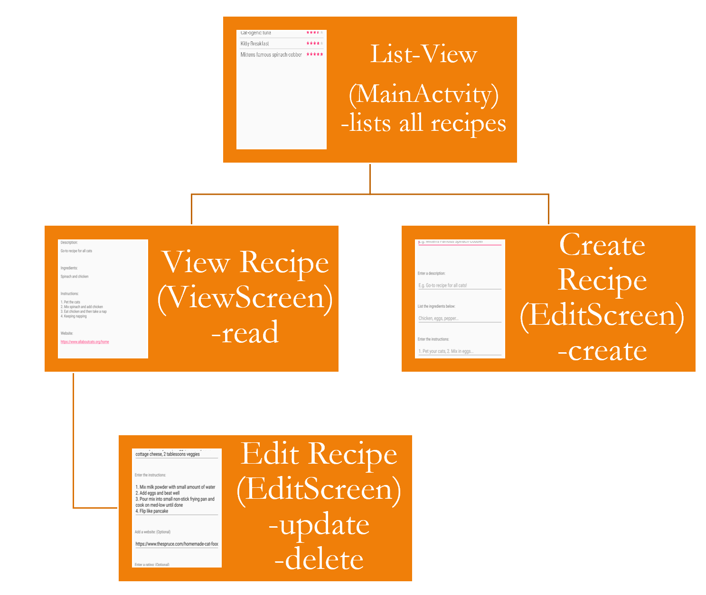
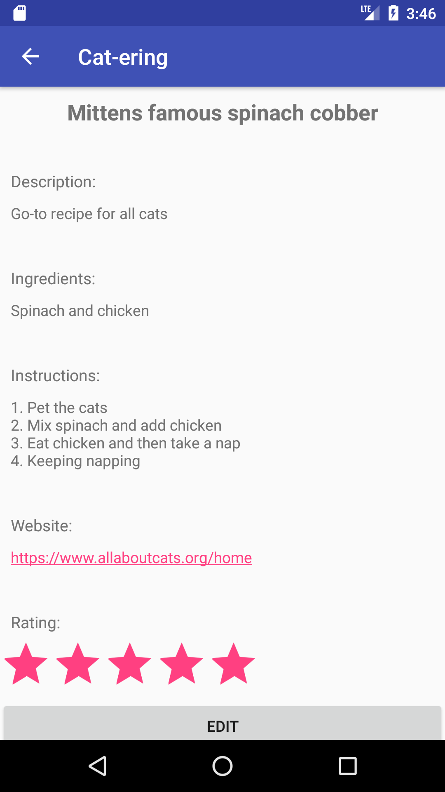

# Cat-ering

‘Cat-ering’ is a recipe application that will allow you to fill in your favorite recipes for your friendly felines. Gone are the days of cooking for one, why not cook for three?! The application offers a list of a few of our favorite cat recipes allowing the user to edit/delete old recipes and/or add new ones to an existing database (Firebase).

<h3> Structure </h3>
The application does basic CRUD operations through the Firebase Database. An outline of the application can be seen below (Fig. 1) 

    
   <b>Figure 1:</b> Basic structure of the application navigation.

<h3> Screenshots </h3>

<figure>
   
    
   <figcaption><b>Figure 2:</b> Viewing existing recipes (left) and creating a new recipe (right).</figcaption>  
</figure>

  

<figure>
   
    
<figcaption><b>Figure 3:</b> Editing/updating an existing recipe (left) and viewing an existing recipe (right).</figcaption>
</figure>

