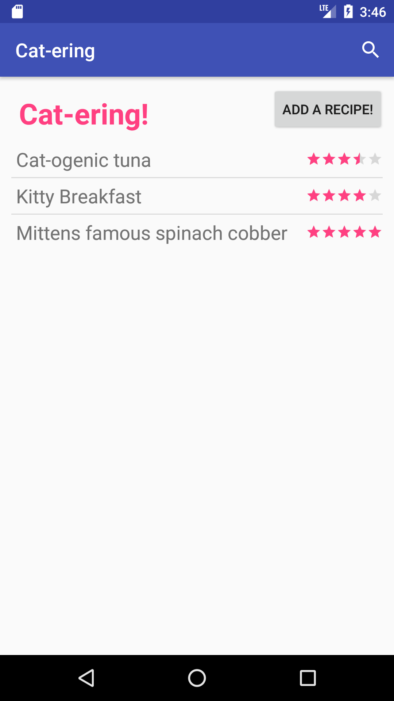
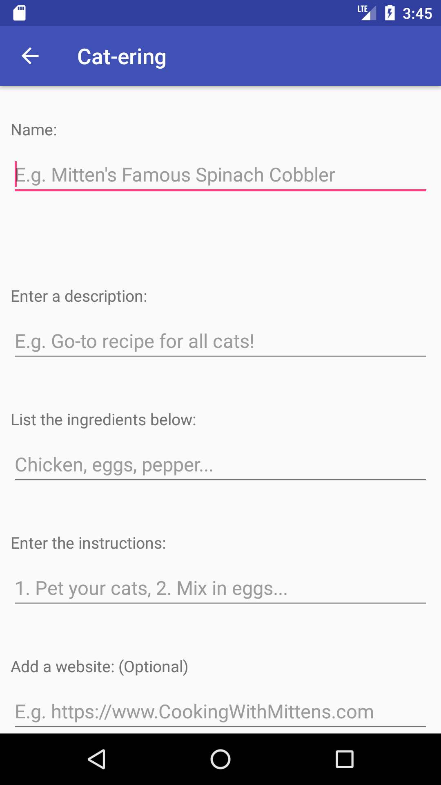
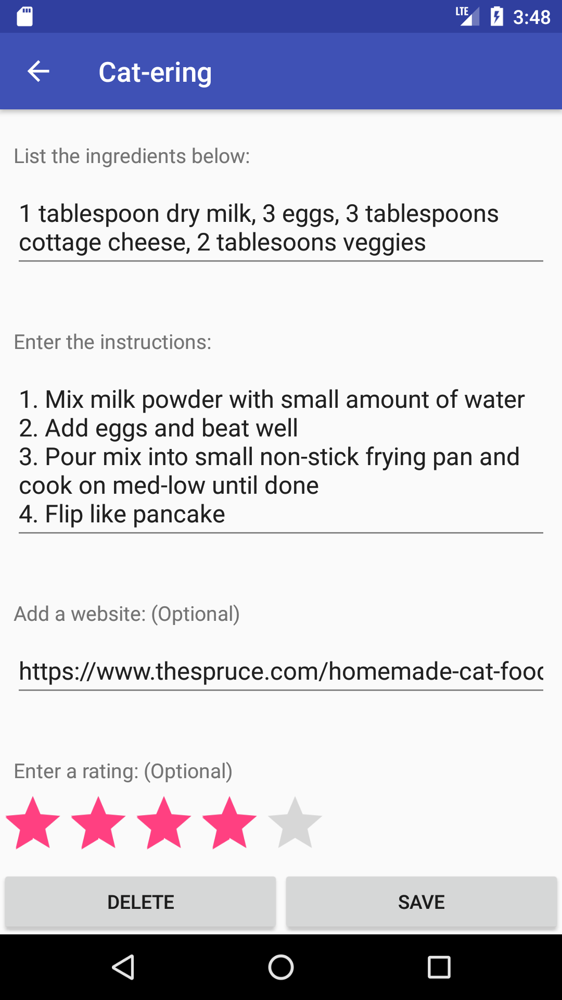

# Cat-ering

‘Cat-ering’ is a recipe application that will allow you to fill in your favorite recipes for your friendly felines. Gone are the days of cooking for one, why not cook for three?! The application offers a list of a few of our favorite cat recipes allowing the user to edit/delete old recipes and/or add new ones to an existing database.

  

<h3> Screenshots </h3>

View a recipe and Create a Recipe

<figure>

   

   <figcaption>View recipes</figcaption>

</figure>

<figure>

   

   <figcaption>Create a recipe</figcaption>

</figure>

<figure>

   

   <figcaption>Edit/update an existing recipe.</figcaption>

</figure>

<figure>

   

   <figcaption>View an existing recipe.</figcaption>

</figure>
